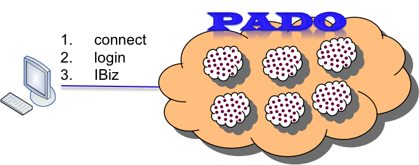

---

 *Pado2 is now available in binary forms as part of [PadoGrid](https://github.com/padogrid). Pado2 tightly integrates with PadoGrid and supports GemFire 9.x and Geode 1.x. See the [Pado Overview](https://github.com/padogrid/padogrid/wiki/Pado-Overview) section of [PadoGrid Manual](https://github.com/padogrid/padogrid/wiki/) for an overview and installation instructions.*

---

## What is Pado?

Pado is a comprehensive software platform for building, managing and servicing true cloud stores on top of data grid products while ensuring performance, linear scalability, data ubiquity, and ease of use.

## Pado and Big Data - Grids within Grid

Pado is designed from the ground up to manage and service big data that can amount to 10’s and 100’s of terabytes.

Pado achieves this by federating one or more grids into one logical grid, which can also further nested by another logical grid. The top-level grid becomes the single entry point to which applications connect and access data. Upon a successful login to the top-level grid, Pado automatically connects the application directly to all relevant grids based on application and user credentials. Applications can also optionally and independently connect directly to any of the grids.



## Simple API

```
Pado.connect("locahost:20000"); // Connect
IPado pado = Pado.login("app-id", "domain-name", "user-name", "password".toCharArray()); // Login
ITemporalBiz temporalBiz = pado.getCatalog().newInstance(ITemporalBiz.class, "grid/path"); // Create IBiz
```

## Pado Features

- Federate data grids into a single logical grid
- Search a vast amount of real-time data records across multiple grids
- Search temporal data with ease 
- Store anything in any form from any where 
- Automatically version and merge data type changes 
- Access data in the form of business objects 
- Change business rules on the fly 
- Share data and services across vertical silo applications 
- Automatically transform any data into bi-temporal data with compact memory footprint
- Access a complete change history of bi-temporal data in delta form
- Establish dynamic entity relationships based on as-of time
- Build security and compliance services with ease
- Integrate business rules engines with temporal containers to execute as-of rules
- Scale out linearly and indefinitely
- Parallelize grid computing to 10’s and 100’s of grid farms with a single command
- Manage all grid farms in a single centralized view
- Run DNAs (Data Node Apps) alongside data nodes in Java or Python

## How?

- *Index matrix*: L2 cache-backed result sets with data aggregation and pagination support
- *Grid-to-grid topology*: a single logical grid of grids
- *Text search engine*: fast temporal-data-integrated Apache Lucene text search services 
- *Universal namespace*: unique hierarchical namespaces across grids 
- *Extreme scalability*: data partitioning across one or more grids 
- *Data ubiquity*: auto-versioning and hot-deployment of data classes 
- *IBiz*: business objects running locally and/or remotely 
- *Web services*: IBiz in the form of web services 
- *Cloud deployment*: hot deployment of IBiz and data classes 
- *Apps*: app credential and management service 
- *JsonLite*: schema-based lightweight JSON objects
- *IBiz catalog*: reusable business objects 
- *Grid routing tables*: grid targeting strategies 
- *ITemporalBiz*: bi-temporal data via a simple API
- *User session management*: token-based session management security backed by RSA & AES 
- *PadoDesktop*: All-in-one GUI (data browser, grid monitor, grid management - available from Netcrest)
- *PadoShell*: Unix-like commands for managing and scripting grids
- *DNA*: Data Node Apps for running out-of-process apps independently alongside individual data nodes (Java and Python supported)

## Supported JDK Versions

:exclamation: Pado requires JDK 1.7 or 1.8 to compile and runs on JDK 1.7 and 1.8.

## Building Pado

1. Download or clone Pado from GitHub: http://github.com/netcrest/pado
2. Install Apache Maven: https://maven.apache.org
3. Run `mvn install -DskipTests` from the Pado root directory.

```
git clone http://github.com/netcrest/pado
cd pado

# Windows
./setenv_build.bat

# Unix
. ./setenv_build.sh

mvn install
```

The above Maven command (#3) compiles all of Pado Maven modules and creates zip and tar distribution files in the `pado-deployment/assembly` directory. It also inflates the tar distribution file in the `deploy/` directory for running and testing the Pado build. 

**IMPORTANT**: Note that it does not overwrite the existing files in the `deploy/` directory, preserving the changes that you may have made from the previous build.

## Building Pado-Web

Pado-web is a web container that provides the Pado RESTful API for accessing IBiz objects. To build the `pado-web-<version>.war` file, follow the instructions in the pado-web repository:  http://github.com/netcrest/pado-web

## Installing Pivotal GemFire

In order to run Pado, you must install Pivotal GemFire, which is downloadable from the following Pivotal web site:

   https://network.pivotal.io/products/pivotal-gemfire

Pado supports GemFire 7.x and 8.x. Once installed, set the `GEMFIRE` environment variable to the GemFire installation root directory in `bin_sh/setenv.sh` as described below.


## Running Pado in a Build Environment

Upon successful build, run the default grid called *mygrid* as follows:

```
cd deploy/pado_<version>/bin_sh
<Edit setenv.sh and set JAVA_HOME, GEMFIRE>
./start_site -locators
```

Load mock data into mygrid as follows:

```
cd client
./temporal -all
```

Run PadoShell to view data in mygrid:

```
cd ..
./pado -dir ..
/mygrid> login
/mygrid> grid -s
/mygrid> ls -lR
/mygrid> less account
/mygrid> quit
```

## Running Demos
The Pado distribution includes demos that can readily be run in your local environment. Each demo can be started or stopped with a single command which manages multiple grids and sites. See <pado-home>/README.txt for demo details.

- **mygrid/mygrid_ssl**: Pado is preconfigured with the mygrid demo. You can ingest mock data and/or the bundled Microsoft's sample Northwind data. You can run in SSL or non-SSL.
- **wan/wan_ssl**: This demo launches three sites with with same mygrid grid paths defined but WAN replication enabled. You can run in SSL or non-SSL.
- **grid?**: This demo launches up to six grids federating five of them by the parent grid named grid0.
